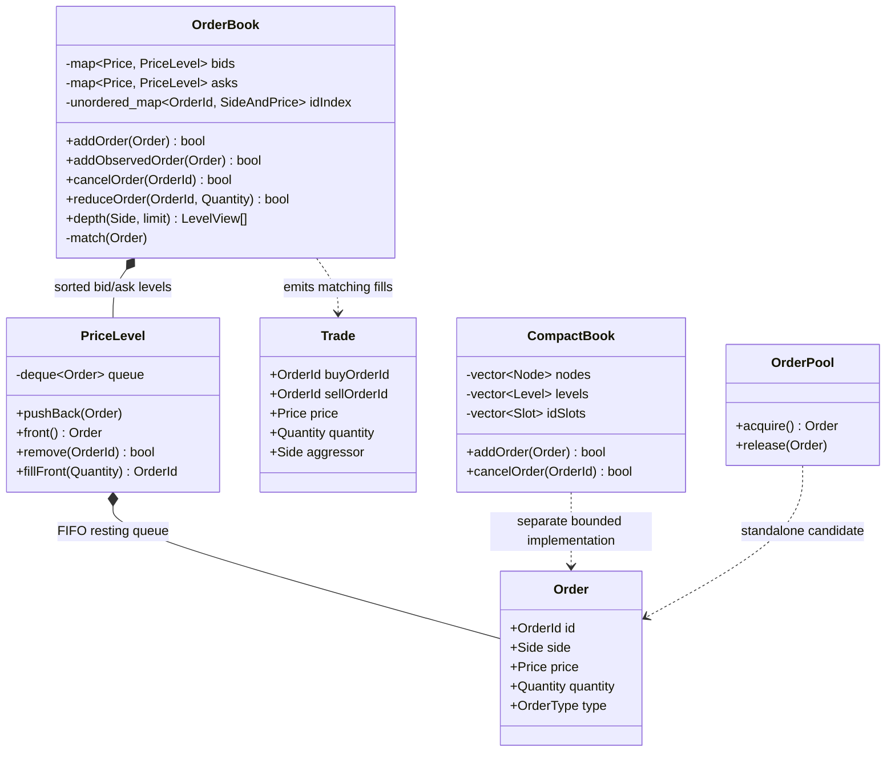
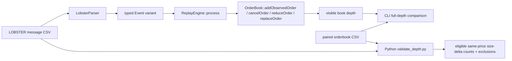
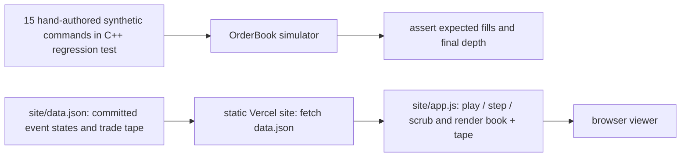

# Architecture as implemented

These diagrams describe the current repository, not the intended optimized engine. They are written in Mermaid so GitHub renders them directly. The matching simulator, historical observed-feed replay, and static browser demo are separate paths.

## Matching book: readable baseline and separate alternative

`OrderBook` is the default C++ simulator: a sorted `std::map` per side, a `std::deque` FIFO inside each `PriceLevel`, and an ID lookup for side and price. A known-ID cancel still scans its price level. `CompactBook` uses fixed-capacity vectors and linked indices in a separately benchmarked implementation; it is **not** a member of `OrderBook` and has a narrower feature contract. The standalone `OrderPool` is **not wired into either book**. Do not infer allocation-free operation or superior speed from this diagram.

## Historical feed: observed state, not new match commands

The C++ CLI in `src/replay/main.cpp` reads paired files and reports its full-depth comparison. `ReplayEngine` applies recorded changes to visible resting orders: a visible execution reduces one resting order; a hidden execution leaves displayed depth alone. It does **not** send historical executions into `OrderBook::match()` as new incoming orders. Separately, `src/replay/validate_depth.py` reads the *same two CSV files* directly and checks eligible same-price displayed-size deltas; it does not validate a fully reconstructed book. The official sample starts after an unknown state, so see [the denominators and exclusions](../REPORT.md) before quoting a result.

## Synthetic demo: a tested trace, not a streaming service

`site/data.json` is a committed, finite trace, not generated by a running C++ backend or streamed from an exchange. The C++ regression test independently replays the same hand-authored command sequence and checks eight expected fill prices/sizes and the final quote. It does **not** parse `data.json` or compare every JSON snapshot. The browser only reads local trace JSON and changes the view. GitHub is the source of record; the Vercel site is deployed separately and has no Git auto-deploy hook.
